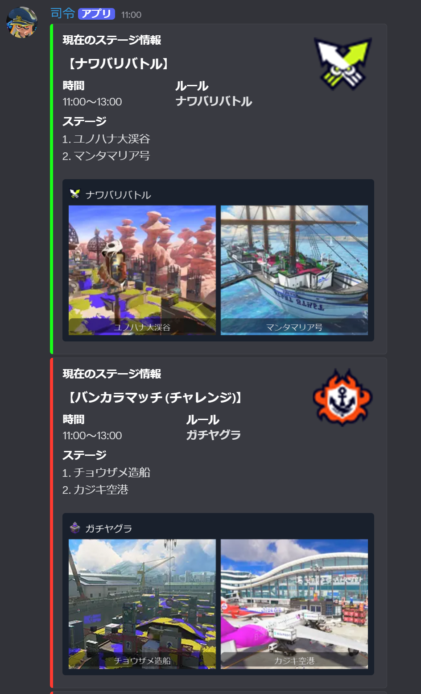
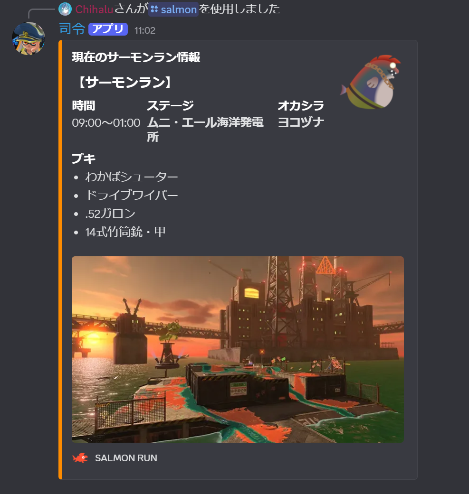

# Splatoon Bot (Discord)

Splatoon3 のステージ情報とサーモンラン情報を Discord で確認できる Bot です。  
通常のコマンドに加えて、ローテーション更新時の自動通知にも対応しています。




## 機能
- `/now` : 現在のステージ情報を表示
- `/next` : 次のステージ情報を表示
- `/salmon` : 現在のサーモンラン情報を表示
- `/team_contest` : バイトチームコンテストを表示
- `/notify_here` : 自動通知の送信先チャンネルをこのチャンネルに設定
- `/notify_test` : 自動通知のテスト送信
- ステージローテーションの変更を検知して自動通知

## セットアップ
### 必要環境
- Python 3.10+

### 依存パッケージ
```bash
pip install discord.py requests pillow
```

※ ステージカード生成で SVG アイコンを使う場合は `cairosvg` も必要です。  
```bash
pip install cairosvg
```

### 環境変数
`.env` を作成して以下を設定してください。
```env
DISCORD_TOKEN=your_bot_token
STAGE_NOTIFY_CHANNEL_ID=123456789012345678
STAGE_NOTIFY_ON_START=1
BOT_ACTIVITY_NAME=Splatoon
```

- `DISCORD_TOKEN` : Discord Bot のトークン（必須）
- `STAGE_NOTIFY_CHANNEL_ID` : 自動通知の送信先チャンネル ID（任意）
- `STAGE_NOTIFY_ON_START` : 起動時に通知する場合は `1`（任意）
- `BOT_ACTIVITY_NAME` : Bot のプレイ中表示（任意）

※ `.env` は Git 管理対象外です。トークンの漏えいに注意してください。

## 実行
```bash
python main.py
```

## 画像アセットについて
`img/` にステージ名・ルール名と同じファイル名の画像を置くと、Embed 内で表示されます。  
例: `img/ゴンズイ地区.png`, `img/ガチエリア.png`

## API
- ステージ/サーモンラン/バイトチームコンテスト情報: https://spla3.yuu26.com/

## License
No license specified.
