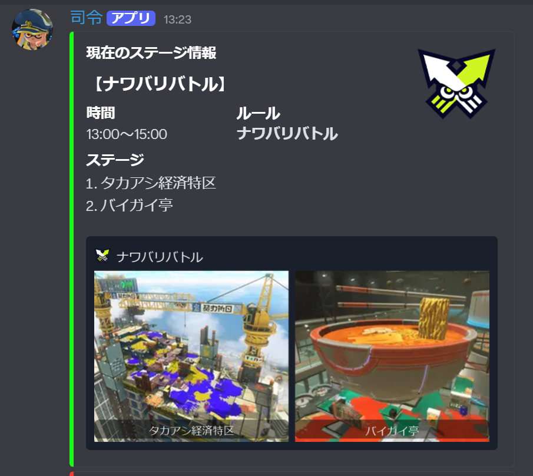
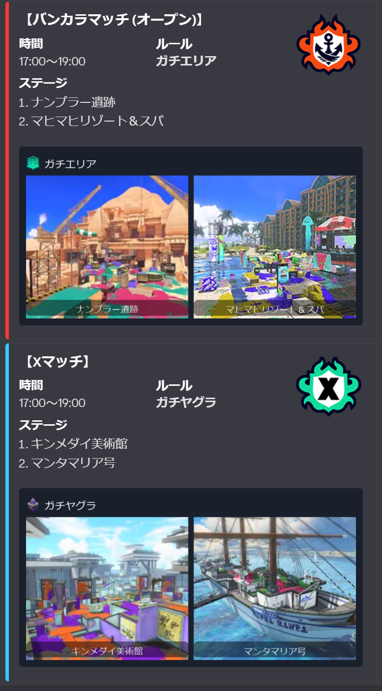
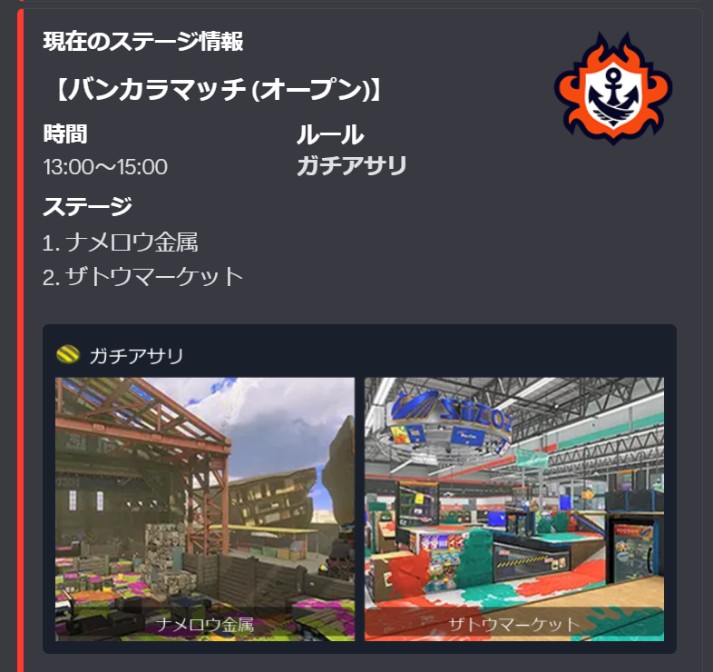
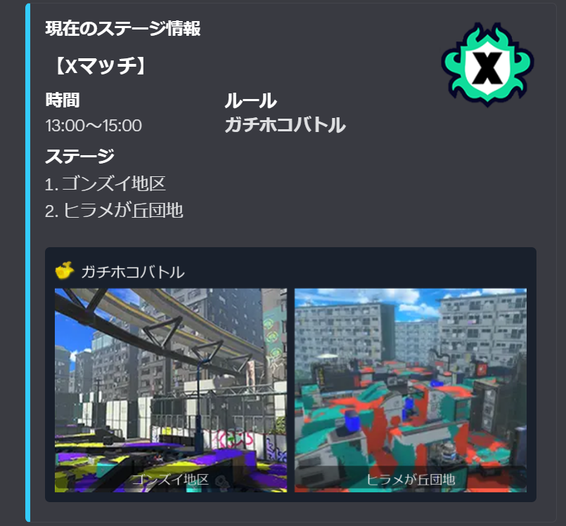
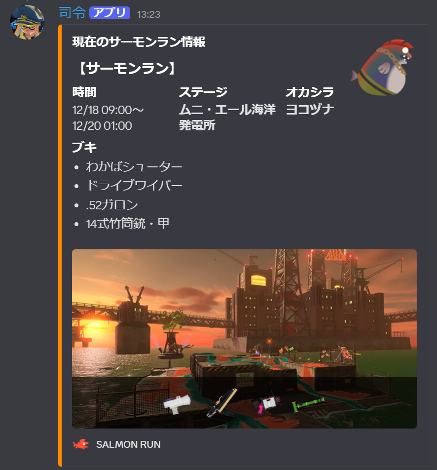
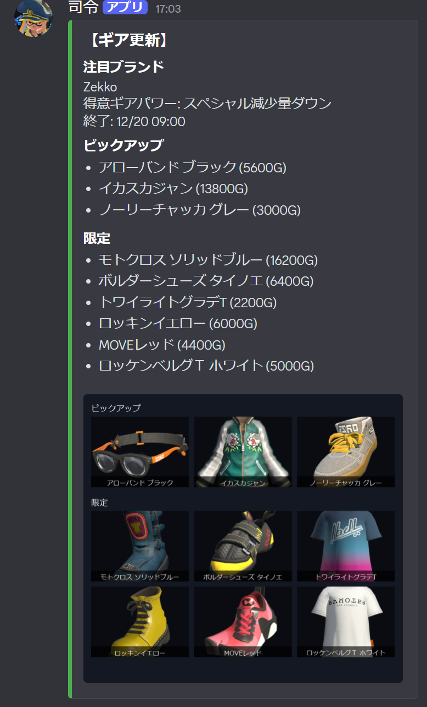

# Splatoon3 Bot

Splatoon3 のステージ情報、サーモンラン情報、イベントマッチ情報、ゲソタウン情報を Discord で確認できる Bot です。

<table>
  <tr>
    <td></td>
    <td></td>
  </tr>
  <tr>
    <td></td>
    <td></td>
  </tr>
  <tr>
    <td></td>
    <td></td>
  </tr>
</table>

## 機能
- ステージ/サーモンラン/イベントマッチ/フェス/ギア更新/Xランキングを表示
- ローテーション更新時や更新検知時の自動通知に対応

## コマンド
### 表示系
- `/next` : 次のステージ情報を表示
- `/all-next` : 取得できる全ての時間帯のステージ情報を表示（自分にのみ表示）
- `/salmon` : 現在のサーモンラン情報を表示
- `/all-salmon` : 取得できる全ての時間帯のサーモンラン情報を表示（自分にのみ表示）
- `/team_contest` : バイトチームコンテストを表示
- `/event` : イベントマッチを表示
- `/all-event` : 取得できる全ての時間帯のイベントマッチ情報を表示（自分にのみ表示）
- `/fest` : 開催中のフェス情報を表示
- `/all-fest` : 取得できる全てのフェス情報を表示（自分にのみ表示）
- `/gear` : ゲソタウンのギア更新情報を表示
- `/monthly_gear` : サーモンラン月替わりギアを表示
- `/xrank` : Xランキング　各ルールの1位を表示

### 通知チャンネル設定
- `/notify_here` : ステージ自動通知の送信先をこのチャンネルに設定
- `/event_notify_here` : イベントマッチ自動通知の送信先をこのチャンネルに設定
- `/salmon_notify_here` : サーモンラン自動通知の送信先をこのチャンネルに設定
- `/team_contest_notify_here` : バイトチームコンテスト自動通知の送信先をこのチャンネルに設定
- `/fest_notify_here` : フェス自動通知の送信先をこのチャンネルに設定
- `/gear_notify_here` : ギア更新自動通知の送信先をこのチャンネルに設定
- `/monthly_gear_notify_here` : サーモンラン月替わりギア自動通知の送信先をこのチャンネルに設定
- `/xrank_notify_here` : Xランキング自動通知の送信先をこのチャンネルに設定

## API
- ステージ/サーモンラン/バイトチームコンテスト/イベントマッチ情報: https://spla3.yuu26.com/
- ギア/Xランキング情報: https://splatoon3.ink/
